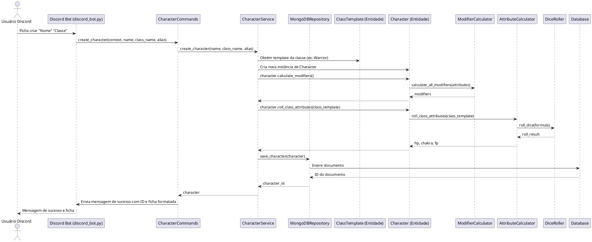
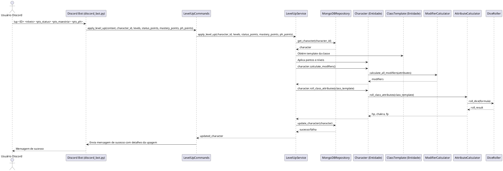
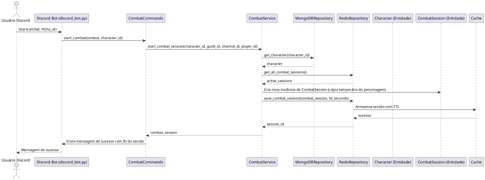
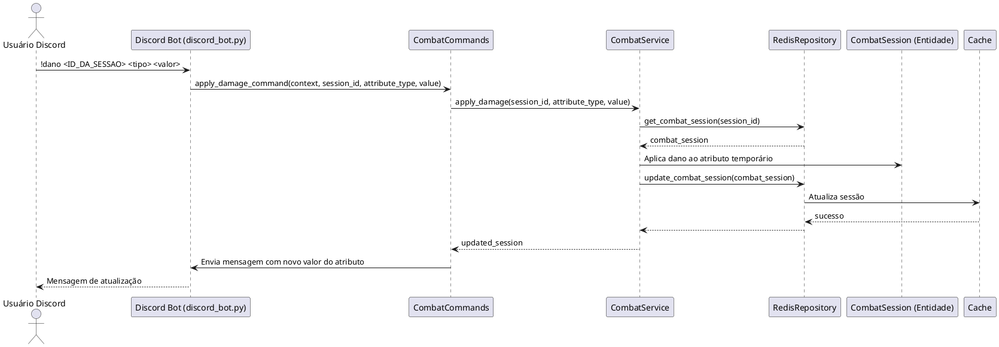

# Diagramas de Sequência

Este documento contém diagramas de sequência que ilustram o fluxo de interação para os principais casos de uso do bot RPG.

## UC-01: Criar Ficha de Personagem



## UC-05: Aplicar Upagem



## UC-08: Iniciar Sessão de Combate



## UC-09: Aplicar Dano



## UC-11: Finalizar Sessão de Combate

```plantuml
@startuml
actor "Usuário Discord" as User
participant "Discord Bot (discord_bot.py)" as Bot
participant "CombatCommands" as CombatCmd
participant "CombatService" as CombatService
participant "RedisRepository" as RedisRepo
participant "MongoDBRepository" as MongoRepo
participant "Character (Entidade)" as CharacterEntity
participant "CombatSession (Entidade)" as CombatSessionEntity

User -> Bot: !endcombat <ID_DA_SESSAO> [--persist]
Bot -> CombatCmd: end_combat_session_command(context, session_id, persist)
CombatCmd -> CombatService: end_combat_session(session_id, persist_changes)
CombatService -> RedisRepo: get_combat_session(session_id)
RedisRepo --> CombatService: combat_session
alt if persist_changes is True
  CombatService -> MongoRepo: get_character(combat_session.character_id)
  MongoRepo --> CombatService: character
  CombatService -> CharacterEntity: Aplica mudanças temporárias ao personagem permanente
  CombatService -> MongoRepo: update_character(character)
  MongoRepo --> CombatService: sucesso/falha
end
CombatService -> RedisRepo: delete_combat_session(session_id)
RedisRepo -> Cache: Remove sessão
Cache --> RedisRepo: sucesso
RedisRepo --> CombatService: sucesso/falha
CombatService --> CombatCmd: sucesso/falha
CombatCmd -> Bot: Envia mensagem de finalização
Bot --> User: Mensagem de finalização
@enduml